<h1 align="center">Architect: Land of Exiles em português do Brasil</h1>

<strong>Tradução de fãs para explorar, lutar e acompanhar a história entendendo o que aparece na tela.</strong>

<strong>131.948 células de texto traduzidas</strong> · <strong>227 tabelas</strong> · <strong>um arquivo de tradução de ~12 MB</strong>

<a href="https://github.com/jackchakkal/architectlandofexiles_BR/releases/download/v14/Architect-PTBR-v14.zip"><strong>⬇️ Baixar a tradução v14</strong></a> · <a href="https://architect-br.vercel.app/"><strong>🌐 Conhecer o site e a wiki</strong></a> · <a href="docs/INSTALACAO-PARA-JOGADORES.md"><strong>📖 Guia de instalação</strong></a>

Tradução comunitária para a versão <strong>Windows do launcher oficial</strong>. Projeto independente, não oficial e feito por fã.

> ### 🎁 Quer apoiar o criador desta tradução?
>
> No **Evento de convite de amigo** do jogo, insira o código **`DC9PMZRL`**. Se você for elegível e cumprir as missões do evento, **você e o criador do projeto podem receber recompensas**. É uma forma opcional de reconhecer o trabalho e aproveitar o evento. [Veja onde inserir o código](#apoie-o-projeto-com-o-código-de-amigo).

<a href="https://architect-br.vercel.app/#galeria">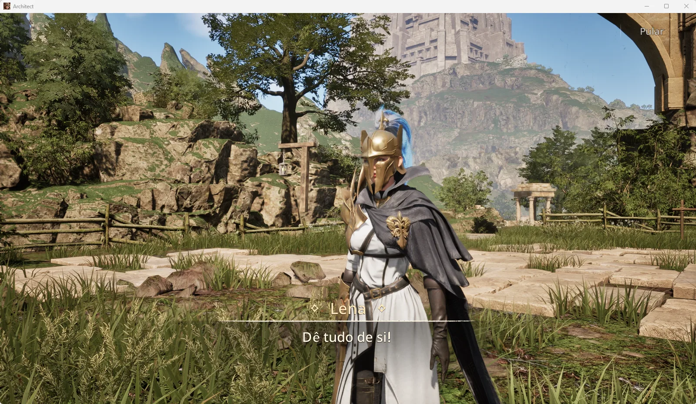</a> Diálogo com Lena em português. Clique para abrir a galeria no site.

## O mundo do jogo, agora mais fácil de acompanhar

Missões, diálogos, objetivos, tutoriais, descrições e boa parte da interface podem ser lidos em português do Brasil. A tradução foi construída sobre **128.598 registros em 227 tabelas de texto**, com **131.948 células traduzidas** na versão v14. O pacote para jogadores vem em um ZIP de cerca de **1,7 MB**; depois de extraído, o arquivo PAK de tradução tem cerca de **12 MB**.

| Área | O que você encontra em português |
| --- | --- |
| **História e missões** | Títulos, descrições, objetivos, etapas, respostas de diálogo e falas de NPCs. |
| **Interface e orientação** | Menus, botões, avisos, resultados, telas de carregamento, interações e parte das configurações. |
| **Personagem e combate** | Atributos, explicações de Skills, efeitos, buffs, debuffs, morte e progressão. |
| **Exploração e atividades** | Mapas, masmorras, Rift, comissões, clã, tutoriais e descrições de conteúdo. |
| **Itens e recompensas** | Descrições de itens, trajes, lojas, coleções e conquistas. |

Veja a [lista detalhada de cobertura e limitações](docs/CONTEUDO-DA-TRADUCAO.md). A **v14** mantém nomes de Skills, itens e masmorras em inglês em todas as menções, facilitando a correspondência com livros de Skill, buscas e nomes exibidos no jogo. Descrições, objetivos e instruções continuam em português. Foram ajustadas **5.970 células** em relação à v13; a contagem de células traduzidas caiu porque nomes próprios voltaram ao original de propósito. A tradução continua recebendo correções com base nas telas enviadas pelos jogadores.

## Veja a tradução dentro do jogo

As 15 imagens abaixo são capturas reais do projeto. Elas mostram tanto a abrangência da tradução quanto pontos ainda em revisão, como trechos cortados ou nomes mantidos no idioma original. Clique em qualquer imagem para ampliá-la no GitHub ou visite a [galeria interativa do site](https://architect-br.vercel.app/#galeria).

### História, missões e exploração

| | |
| --- | --- |
| <a href="site/images/carregamento.webp">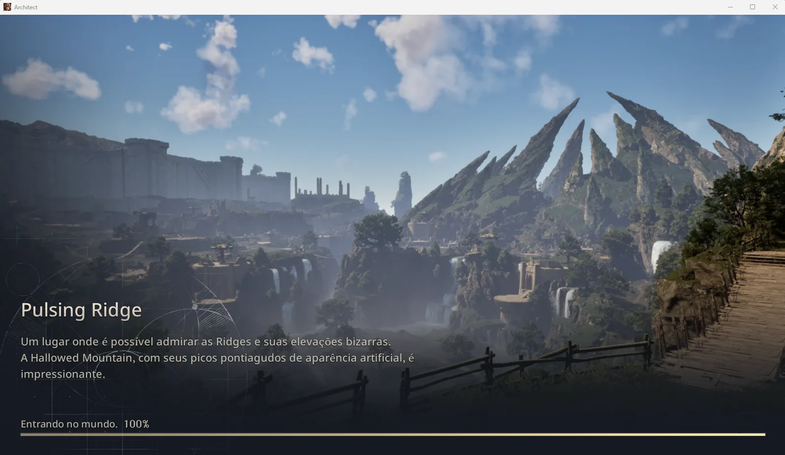</a> Descrição do mundo na tela de carregamento. | <a href="site/images/comissao.webp">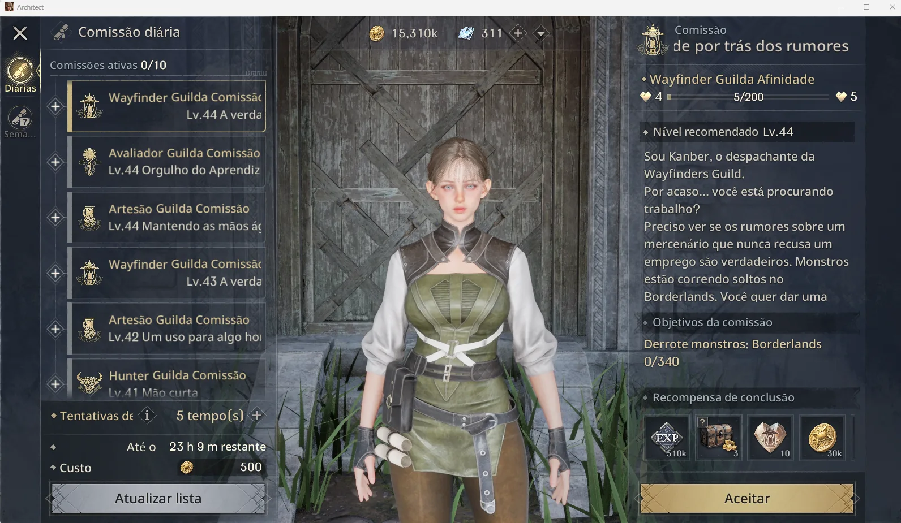</a> Comissões, objetivos e recompensas. |
| <a href="site/images/mapa.webp">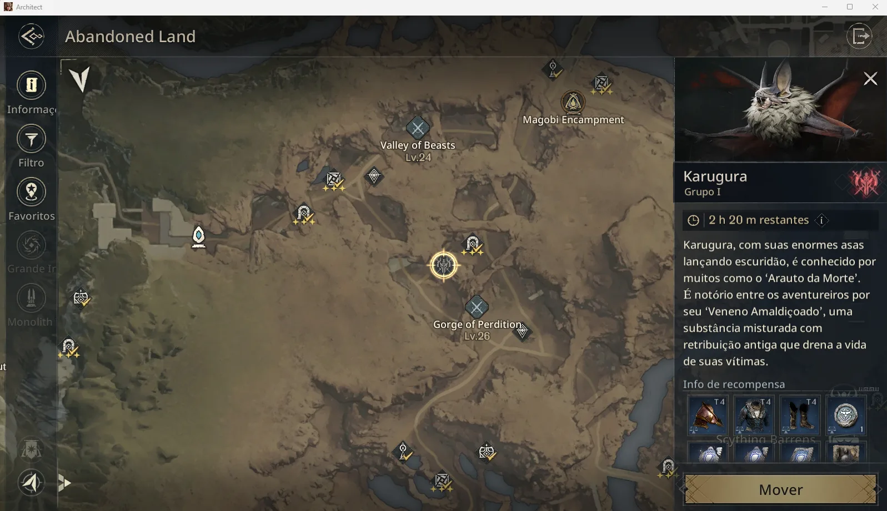</a> Mapa e descrição de chefe. | <a href="site/images/objetivo.webp">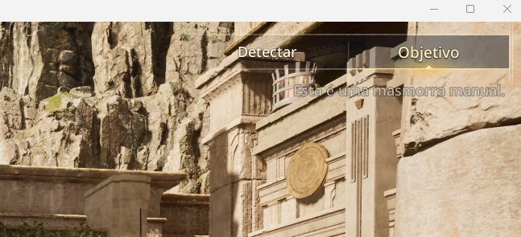</a> Objetivo de masmorra. |

### Atividades e sistemas

| | |
| --- | --- |
| <a href="site/images/offline-ia.webp">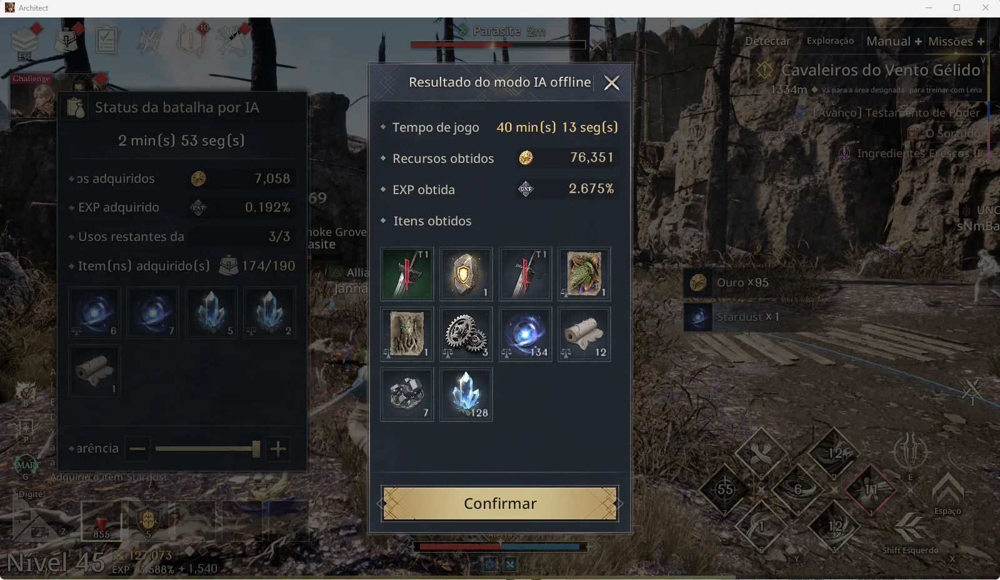</a> Resultado do modo IA offline. | <a href="site/images/rift.webp">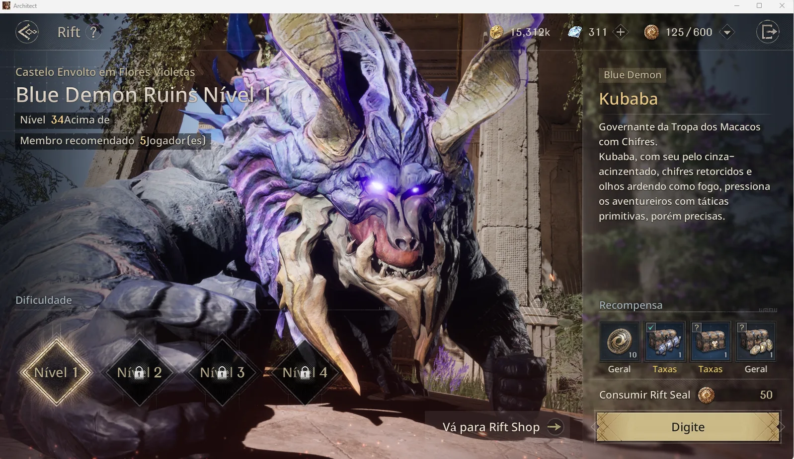</a> Rift, chefe e recompensas. |
| <a href="site/images/barreira.webp">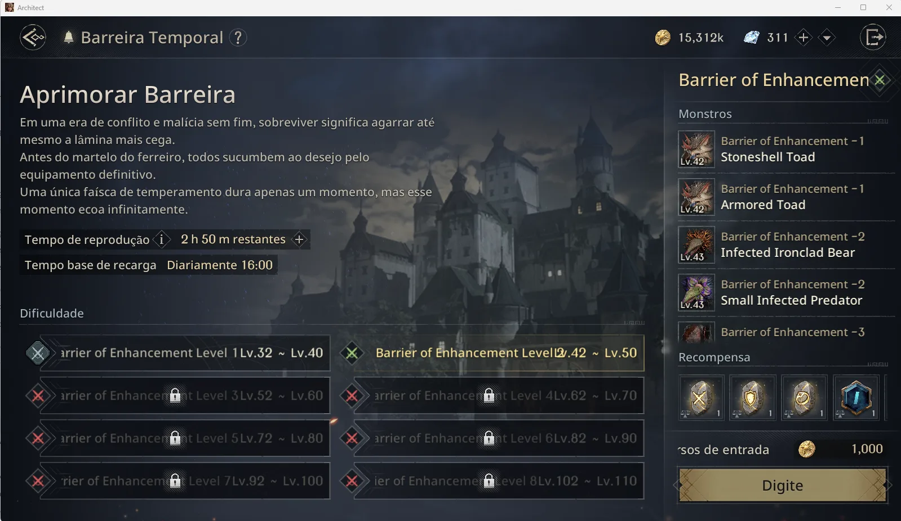</a> Barreira Temporal. | <a href="site/images/cla.webp">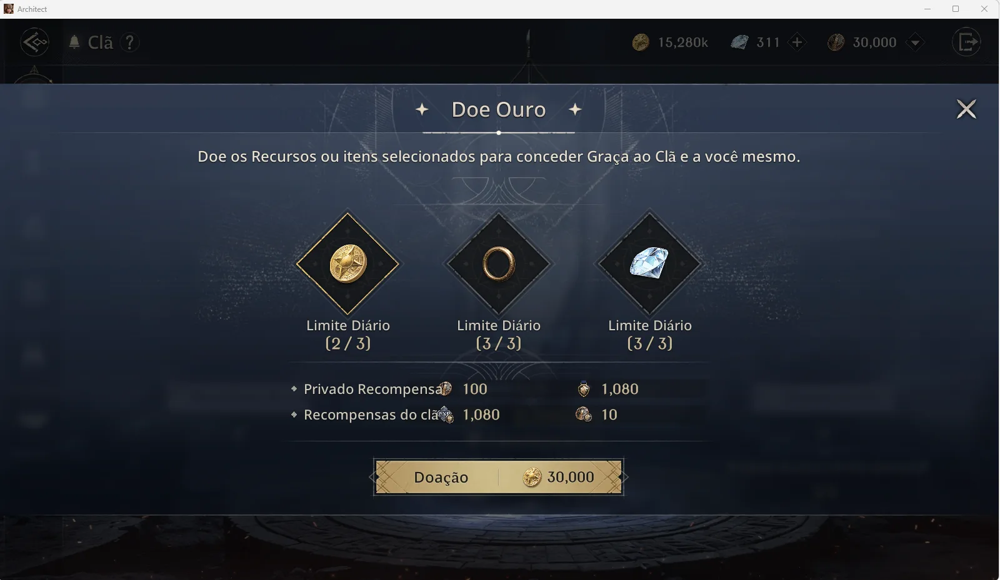</a> Clã e doação. |

### Personagem, combate e progressão

| | |
| --- | --- |
| <a href="site/images/classe.webp">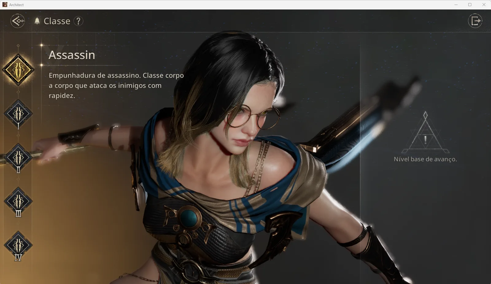</a> Descrição da classe Assassin. | <a href="site/images/skills.webp">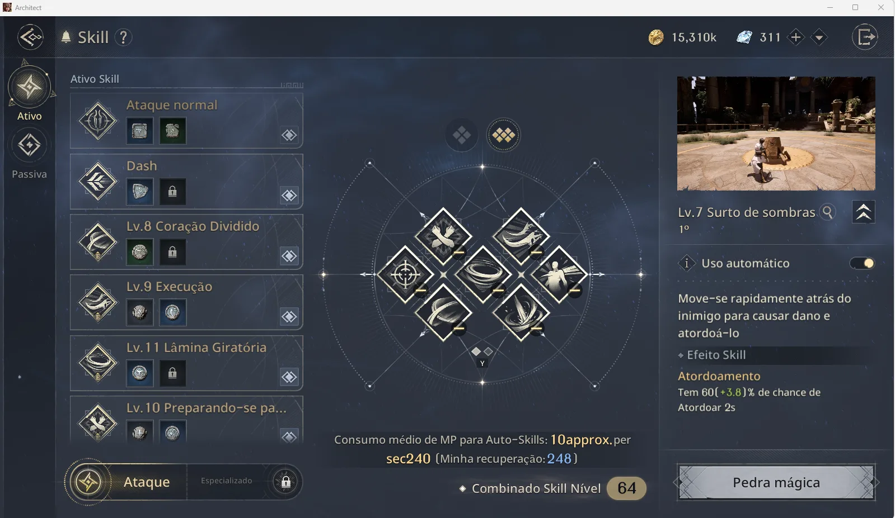</a> Explicações de Skill. |
| <a href="site/images/atributos.webp">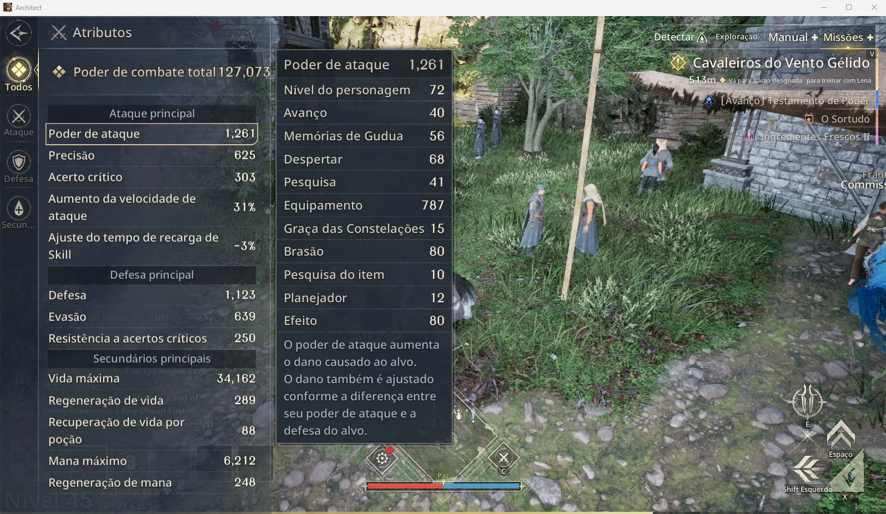</a> Atributos e explicação de estatísticas. | <a href="site/images/derrota.webp">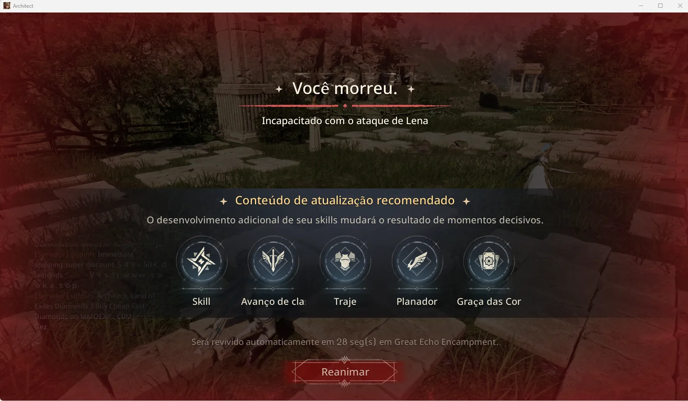</a> Tela de derrota e orientação ao jogador. |

### Configurações e opções

| | |
| --- | --- |
| <a href="site/images/configuracoes-graficos.webp">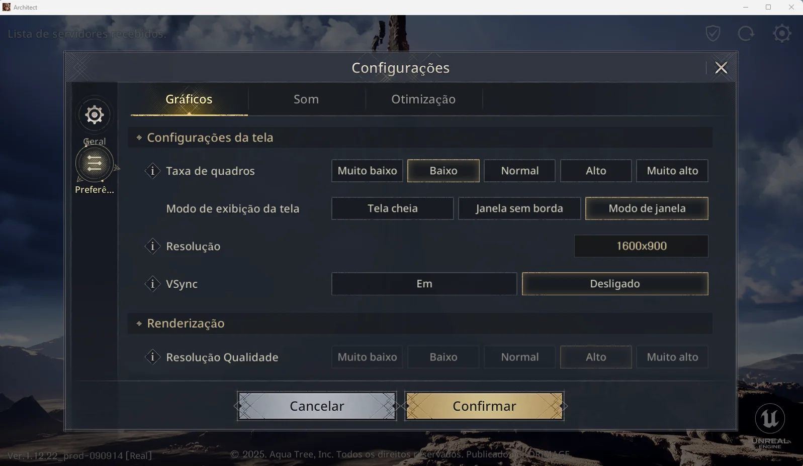</a> Gráficos, tela e renderização. | <a href="site/images/configuracoes-otimizacao.webp">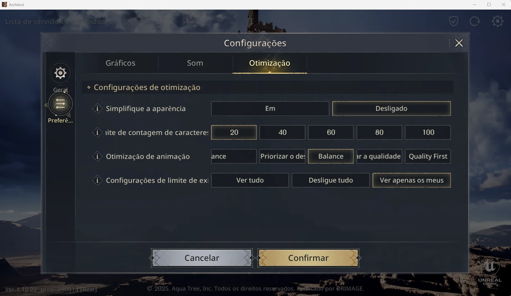</a> Otimização. Alguns rótulos ainda precisam de ajustes. |

## Instale e jogue em português

1. [**Baixe o ZIP da v14**](https://github.com/jackchakkal/architectlandofexiles_BR/releases/download/v14/Architect-PTBR-v14.zip) e extraia todos os arquivos.
2. Feche o jogo e o launcher. Execute **`Instalar-Traducao-PTBR.bat`** na pasta extraída.
3. Abra o jogo e selecione **Português (Brasil)** no lugar da opção “English”.

O instalador localiza o jogo, confere o hash do arquivo e copia **um PAK de texto** para `ProjectTT\Content\Paks\`. Os arquivos originais do jogo ficam no lugar. O ZIP inclui um desinstalador; você também pode [instalar e remover manualmente, sem executar scripts](docs/INSTALACAO-PARA-JOGADORES.md#instalação-manual-sem-executar-scripts).

| Quer conferir antes de instalar? | Acesso direto |
| --- | --- |
| Ler exatamente o que o instalador faz | [Explicação simples](docs/TRANSPARENCIA.md) · [Código do instalador](tools/player-installer/install.ps1) |
| Conferir a versão e a integridade | [Manifesto v14 e hashes SHA-256](releases/v14/manifest.json) |
| Ver os textos e propor correções | [Tabelas traduzidas da v14](translations/v14/) · [Glossário e regras](docs/GLOSSARIO-E-REGRAS.md) |
| Entender por que o arquivo funciona | [Como o jogo carrega a tradução](docs/COMO-A-TRADUCAO-E-CARREGADA.md) |

**Compatibilidade:** versão Windows do launcher oficial. Uma atualização do jogo pode exigir nova versão da tradução. Como o jogo é online e usa anticheat, o uso de modificações fica sujeito às regras do serviço; leia os [cuidados antes de instalar](docs/INSTALACAO-PARA-JOGADORES.md#antes-de-começar).

## Apoie o projeto com o código de amigo

A tradução é um trabalho de fã disponibilizado para a comunidade. Se ela tornou sua experiência melhor, você pode ajudar o criador usando **`DC9PMZRL`** no evento de convite do próprio jogo. Quando as condições do evento são atendidas, há recompensas para quem registra o código e para quem convidou.

1. No jogo, abra **Desafio do Arquiteto → Eventos → Evento de convite de amigo**.
2. Acesse **Detalhes do convite → Insira o código de convite**.
3. Digite **`DC9PMZRL`**, clique em **Registrar** e confira as missões do evento.

| Evento de convite | Onde registrar o código | Código mostrado no jogo |
| --- | --- | --- |
| <a href="site/images/convite-evento.webp">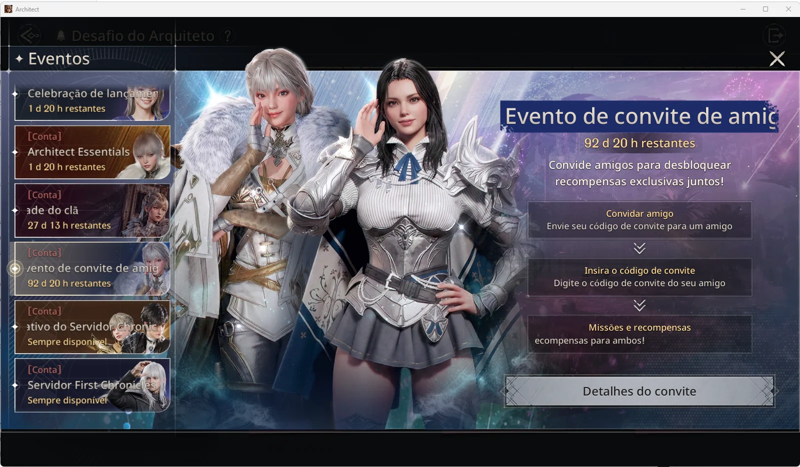</a> | <a href="site/images/convite-inserir.webp">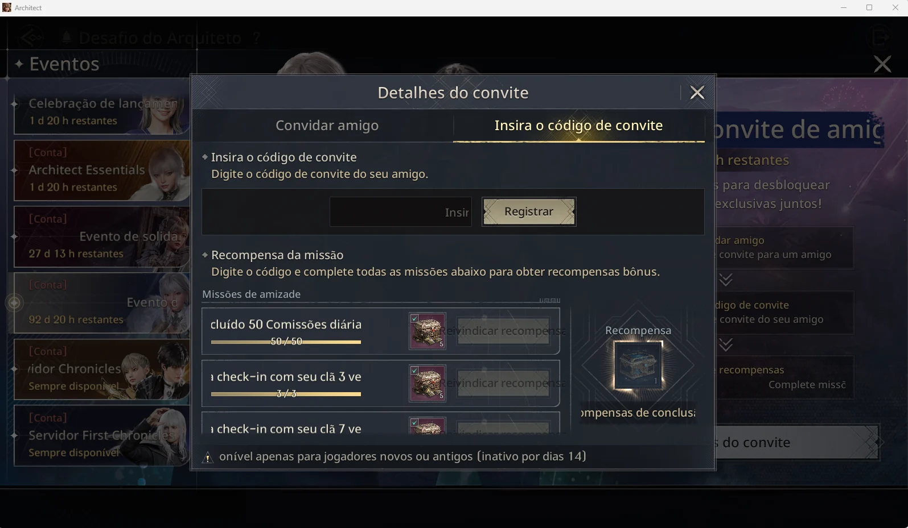</a> | <a href="site/images/convite-codigo.webp">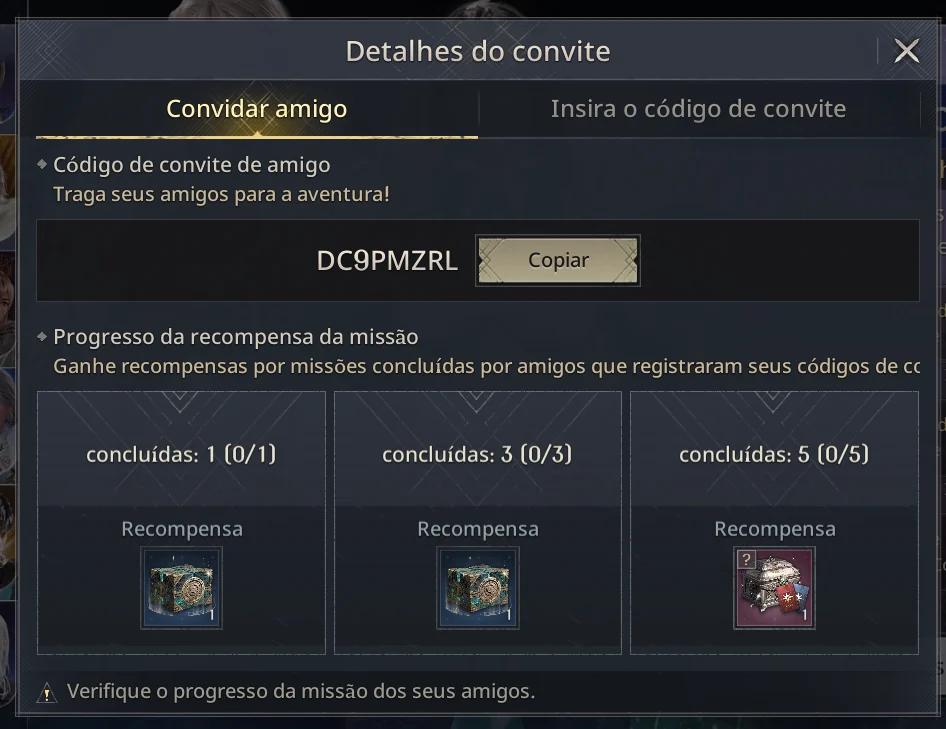</a> |

**Participação opcional.** O evento e suas regras pertencem ao jogo. Disponibilidade, elegibilidade, missões e recompensas podem mudar; confira as condições atuais na própria tela do evento. [O site também explica o passo a passo e permite copiar o código](https://architect-br.vercel.app/#convite).

## O que permanece em inglês?

Alguns nomes de **itens, monstros, chefes, NPCs, áreas e masmorras** foram preservados para facilitar a busca no Marketplace e a conversa com jogadores de outras regiões. As descrições podem estar traduzidas mesmo quando o nome permanece original. Termos como `Skill`, `Codex` e `Giant's Tower` também são mantidos.

Textos enviados prontos pelo servidor, textos gravados em imagens e alguns conteúdos fora das tabelas CSV não são alterados por este pacote. Também podem surgir textos novos ou rótulos cortados após atualizações. A [cobertura detalhada](docs/CONTEUDO-DA-TRADUCAO.md) explica esses casos sem prometer tradução total de cada tela.

## Conheça o Architect Atlas

**[Acesse architect-br.vercel.app](https://architect-br.vercel.app/)** para explorar a wiki em português, pesquisar **76 guias**, ampliar as capturas de tela, consultar a página da tradução e entender cada etapa da instalação. O site reúne também o [código de amigo e as instruções do evento](https://architect-br.vercel.app/#convite), [transparência sobre os arquivos](https://architect-br.vercel.app/#transparencia), [feedback sobre a tradução](https://architect-br.vercel.app/#feedback) e um [canal privado de contato](https://architect-br.vercel.app/contato) para colaboração, parcerias ou pedidos de revisão e remoção.

> **Sua experiência ajuda a próxima versão.** Encontrou uma frase estranha, uma opção cortada ou um trecho em inglês? [Envie uma sugestão pelo site](https://architect-br.vercel.app/#feedback) ou [abra uma Issue](https://github.com/jackchakkal/architectlandofexiles_BR/issues) com a tela e, se possível, uma captura. Para mensagens que não devem ser públicas, use a [página de contato](https://architect-br.vercel.app/contato).

## Para quem quer colaborar

As tabelas publicadas em [`translations/v14/`](translations/v14/) podem ser revisadas por qualquer pessoa. As versões preservam seus próprios snapshots; alterações ficam documentadas em [`changes/`](changes/). O [processo técnico](docs/TECHNICAL_PROCESS.md) descreve extração, comparação depois de atualizações, auditoria e criação do PAK. A chave AES usada na manutenção do pacote não é publicada neste repositório.

## Projeto de fãs, sem vínculo oficial

Este é um **trabalho independente feito por fã**. A tradução, a wiki e o site não são oficiais e não têm relação, aprovação ou suporte da desenvolvedora, da editora ou de qualquer empresa responsável por *Architect: Land of Exiles*. Nomes, personagens e imagens do jogo pertencem aos respectivos titulares e aparecem aqui para apresentar e documentar o projeto comunitário. Para questões de direitos, revisão ou remoção, use o [contato privado](https://architect-br.vercel.app/contato#mensagem-privada).

**English:** Independent fan project. This translation, wiki, and website are unofficial and are not affiliated with, endorsed by, or supported by the game developer, publisher, or any company responsible for *Architect: Land of Exiles*. Game names, characters, and images belong to their respective rights holders. For rights inquiries or removal requests, use the [private contact form](https://architect-br.vercel.app/contato#mensagem-privada).
